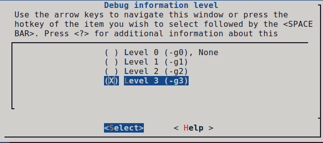
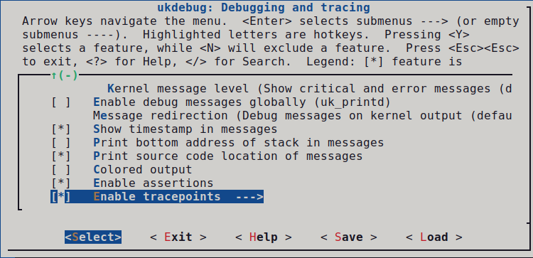

Because unikernels aim to be a more efficient method of virtualization, then we should have certain mechanisms to measure this.
Of course, in addition to identifying bottlenecks, we also need a way to fix any bugs.
This session aims to familiarize you with the tools and setup needed to achieve a benchmark for an application or to solve any problem encountered during development.

## Reminders

At this stage, you should be familiar with the steps of configuring, building and running any application within Unikraft and know the main parts of the architecture.
Below you can see a list of the commands you have used so far.

| Command                                             | Description                                                             |
|-----------------------------------------------------|-------------------------------------------------------------------------|
| kraft list                                          | Get a list of all components that are available for use with kraft      |
| kraft up -t application_name your_application_name  | Download, configure and build existing components into unikernel images |
| kraft run                                           | Run resulting unikernel image                                           |
| kraft init -t application_name                      | Initialize the application                                              |
| kraft configure                                     | Configure platform and architecture(interactive)                        |
| kraft configure -p platform -m arhitecture          | Configure platform and architecture(non-interactive)                    |
| kraft build                                         | Build the application                                                   |
| kraft clean                                         | Clean the application                                                   |
| make menuconfig                                     | Configure application through the main menu                             |

## Debugging

### Debugging in Unikraft

Contrary to popular belief, debugging a unikernel is in fact simpler than debugging a standard operating system.
Since the application and OS are linked into a single binary, debuggers can be used on the running unikernel to debug both application and OS code at the same time.
A couple of hints that should help starting:

1. In the configuration menu (presented with `make menuconfig`), under `Build Options` make sure that `Drop unused functions and data` is **unselected**.
   This prevents Unikraft from removing unused symbols from the final image and, if enabled, might hide missing dependencies during development.
2. Use `make V=1` to see verbose output for all of the commands being executed during the build.
   If the compilation for a particular file is breaking and you would like to understand why (e.g., perhaps the include paths are wrong), you can debug things by adding the `-E` flag to the command, removing the `-o [objname]`, and redirecting the output to a file which you can then inspect.
3. Check out the targets under `Miscellaneous` when typing `make help`, these may come in handy.
   For instance, `make print-vars` enables inspecting at the value of a particular variable in `Makefile.uk`.
4. Use the individual `make clean-[libname]` targets to ensure that you're cleaning only the part of Unikraft you're working on and not all the libraries that it may depend on.
   This will speed up the build and thus the development process.
5. Use the Linux user space platform target (`linuxu`) for quicker and easier development and debugging.

### Using GDB

The build system always creates two image files for each selected platform:
- one that includes debugging information and symbols (`.dbg` file extension)
- one that does not

Before using GDB, go to the configuration menu under `Build Options` and select a `Debug information level` that is bigger than 0.
We recommend 3, the highest level.



Once set, save the configuration and build your images.

#### Linux
---

For the Linux user space target (`linuxu`) simply point GDB to the resulting debug image, for example:

```
gdb build/app-helloworld_linuxu-x86_64.dbg
```

#### KVM
---

For KVM, you can start the guest with the kernel image that includes debugging information, or the one that does not.
We recommend creating the guest in a paused state (the `-S` option):

```
qemu-system-x86_64 -s -S -cpu host -enable-kvm -m 128 -nodefaults -no-acpi -display none -serial stdio -device isa-debug-exit -kernel build/app-helloworld_kvm-x86_64.dbg -append verbose
```

Note that the `-s` parameter is shorthand for `-gdb tcp::1234`.
To avoid this long `qemu-system-x86` command with a lot of arguments, we can use `qemu-guest`.

```
qemu-guest -P -g 1234 -k build/app-helloworld_kvm-x86_64.dbg
```

Now connect GDB by using the debug image with:

```
gdb --eval-command="target remote :1234" build/app-helloworld_kvm-x86_64.dbg
```

Unless you're debugging early boot code (until `_libkvmplat_start32`), you’ll need to set a hardware break point:
Hardware breakpoints have the same effect as the common software breakpoints you are used to, but they are different in the implementation.
As the name suggests, hardware breakpoints are based on direct hardware support.
This may limit the number of breakpoints you can set, but makes them especially useful when debugging kernel code.

```
hbreak [location]
continue
```

We’ll now need to set the right CPU architecture:

```
disconnect
set arch i386:x86-64:intel
```

And reconnect:
```
tar remote localhost:1234
```

You can now run `continue` and debug as you would normally.

#### Xen
---

{}
For Xen you first need to create a VM configuration (save it under `helloworld.cfg`):

```
name          = 'helloworld'
vcpus         = '1'
memory        = '4'
kernel        = 'build/app-helloworld_xen-x86_64.dbg'
```
Start the virtual machine with:

`xl create -c helloworld.cfg`

{}


For Xen the process is slightly more complicated and depends on Xen's `gdbsx` tool.
First you'll need to make sure you have the tool on your system.
Here are sample instructions to do that:

```
[get Xen sources]
./configure
cd tools/debugger/gdbsx/ && make
```

The `gdbsx` tool will then be under tools/debugger.
For the actual debugging, you first need to create the guest (we recommend paused state: `xl create -p`), note its domain ID (`xl list`) and execute the debugger backend:

```
gdbsx -a [DOMAIN ID] 64 [PORT]
```

You can then connect GDB within a separate console and you;re ready to debug:

```
gdb --eval-command="target remote :[PORT]" build/helloworld_xen-x86_64.dbg
```

You should be also able to use the debugging file (`build/app-helloworld_xen-x86_64.dbg`) for GDB instead passing the kernel image.

## Tracepoints

Because Unikraft needs a tracing and performance measurement system, one method to do this is using Unikrat's tracepoint system.
A tracepoint provides a hook to call a function that you can provide at runtime. 
You can put tracepoints at important locations in the code.
They are lightweight hooks that can pass an arbitrary number of parameters, which prototypes are described in a tracepoint declaration placed in a header file.

### Dependencies

We provide some tools to read and export trace data that were collected with Unikraft's tracepoint system.
The tools depend on Python3, as well as the click and tabulate modules.
You can install them by running (Debian/Ubuntu):

```
sudo apt-get install python3 python3-click python3-tabulate
```

### Enabling Tracing

Tracepoints are provided by `lib/ukdebug`.
To enable Unikraft to collect trace data, enable the option `CONFIG_LIBUKDEBUG_TRACEPOINTS` in your configuration (via `make menuconfig` under `Library Configuration -> ukdebug -> Enable tracepoints`).




The configuration option `CONFIG_LIBUKDEBUG_ALL_TRACEPOINTS` activates **all** existing tracepoints.
Because tracepoints may noticeably affect performance, you can alternatively enable tracepoints only for compilation units that you are interested in.

This can be done with the `Makefile.uk` of each library.

```
# Enable tracepoints for a whole library
LIBNAME_CFLAGS-y += -DUK_DEBUG_TRACE
LIBNAME_CXXFLAGS-y += -DUK_DEBUG_TRACE

# Alternatively, enable tracepoints of source files you are interested in
LIBNAME_FILENAME1_FLAGS-y += -DUK_DEBUG_TRACE
LIBNAME_FILENAME2_FLAGS-y += -DUK_DEBUG_TRACE
```

This can also be done by defining `UK_DEBUG_TRACE` in the head of your source files.
Please make sure that `UK_DEBUG_TRACE` is defined before `<uk/trace.h>` is included:

```
#ifndef UK_DEBUG_TRACE
#define UK_DEBUG_TRACE
#endif

#include <uk/trace.h>
```

As soon as tracing is enabled, Unikraft will store samples of each enabled tracepoint into an internal trace buffer.
Currently this is not a circular buffer.
This means that as soon as it is full, Unikraft will stop collecting further samples.

### Creating Tracepoints

Instrumenting your code with tracepoints is done by two steps.
First, you define and register a tracepoint handler with the `UK_TRACEPOINT()` macro.
Second, you place calls to the generated handler at those places in your code where your want to trace an event:

```
#include <uk/trace.h>

UK_TRACEPOINT(trace_vfs_open, "\"%s\" 0x%x 0%0o", const char*, int, mode_t);

int open(const char *pathname, int flags, ...)
{
      trace_vfs_open(pathname, flags, mode);

      /* lots of cool stuff */

      return 0;
}
```

`UK_TRACEPOINT(trace_name, fmt, type1, type2, ... typeN)` generates the handler `trace_name()` (static function).
It will accept up to 7 parameters of type `type1`, `type2`, etc.
The given format string `fmt` is a printf-style format which will be used to create meaningful messages based on the collected trace parameters.
This format string is only kept in the debug image and is used by the tools to read and parse the trace data.
Unikraft's trace buffer stores for each sample a timestamp, the name of the tracepoint, and the given parameters.


### Reading Trace Data

Unikraft is storing trace data to an internal buffer that resides in the guest's main memory.
You can use GDB to read and export it.
For this purpose, you will need to load the `uk-gdb.py` helper script into your GDB session.
It adds additional commands that allow you to list and store the trace data.
We recommend to automatically load the script to GDB.
For this purpose, add the following line to your `~/.gdbinit`:

```
source /path/to/your/build/uk-gdb.py
```

In order to collect the data, open GDB with the debug image and connect to your Unikraft instance as described in Section [Using GDB](#using-gdb):

```
gdb build/app-helloworld_linuxu-x86_64.dbg
```

The `.dbg` image is required because it contains offline data needed for parsing the trace buffer.

As soon as you let run your guest, samples should be stored in Unikraft's trace buffer.
You can print them by issuing the gdb command `uk trace`:

```
(gdb) uk trace
```

Alternatively, you can save all trace data to disk with `uk trace save <filename>`:

```
(gdb) uk trace save traces.dat
```

It may make sense to connect with GDB after the guest execution has been finished (and the trace buffer got filled).
For this purpose, make sure that your hypervisor is not destroying the instance after guest shut down (on QEMU add `--no-shutdown` and `--no-reboot` parameters).

If you are seeing the error message `Error getting the trace buffer. Is tracing enabled?`, you probably did not enable tracing or Unikraft's trace buffer is empty.
This can happen when no tracepoint was ever called.

Any saved trace file can be later processed with the `trace.py` script. In our example:

```
support/scripts/uk_trace/trace.py list traces.dat
```

## Benchmarking


## Uniprof

[Uniprof](https://github.com/sysml/uniprof) is a unikernel profiler and performance debugger that gives developers insight into their unikernel behavior transparently, without having to instrument the unikernel itself.
Right now works on both x86 and ARM architectures and is available only for Xen platform.
It can be integrated with [Flame Graph](https://github.com/brendangregg/FlameGraph) and in this way you can see all the stack traces into a user-friendly interface.
Right now you can see an example of integration between Unikraft and Uniprof [here](https://github.com/gabrielmocanu/Uniprof-FlameGraph).

## Summary

## Practical Work

### 01. Tutorial. Use GDB in Unikraft

For this tutorial, we will just start the `app-helloworld` application and inspect it with the help of GDB.

First make sure you have the following file structure in your working directory:

```
workdir
|_______apps
|	|_______helloworld
|_______libs
|_______unikraft
```

#### Linuxu

For the image for the **linuxu** platform we can use GDB directly with the binary already created.

```
gdb build/app-helloworld_linuxu-x86_64.dbg
```

#### KVM

To avoid using a command with a lot of parameters that you noticed above in the **KVM** section, we can use `qemu-guest`.


```
qemu-guest -P -g 1234 -k build/app-helloworld_kvm-x86_64.dbg
```


### 02. Mistery. Find the secret using GDB

Before starting the task let's get familiar with some gdb commands.

`ni` - go to the next instruction, but skip function calls

`si` - go to the next instruction, but enters function calls

`c` - continue execution to the next breakpoint

`p expr` - display the value of an expression

`x addr` - get the value at the indicated address (similar to `p *addr`)

`whatis arg` - print the data type of arg

GDB provides convenience variables that you can use within GDB to hold on to a value and refer to it later.
For example:

`set $foo = *object_ptr`

Note that you can also cast variables in GDB similar to C:

`set $var = (int *) ptr`

If you want to dereference a pointer and actually see the value, you can use the following command:

`p *addr`

You can find more gdb commands [here](https://users.ece.utexas.edu/~adnan/gdb-refcard.pdf)

Now, let's get back to the task.
Navigate to `summer-of-code-2021/content/en/docs/sessions/03-benchmarking-and-debugging/work/02` directory and use the 2 scripts: `debug.sh` and `connect.sh` to start the `mistery_kvm-x86_64.dbg` executable using gdb. Do you think you can find out the **secret**?

**HINT** Use the nm utility on the binary as a starting point.

### 03. Work Item 3

### 04. Work Item 4

## Further Reading

>>>>>>> Enhancement: Adding debug documentation part.
