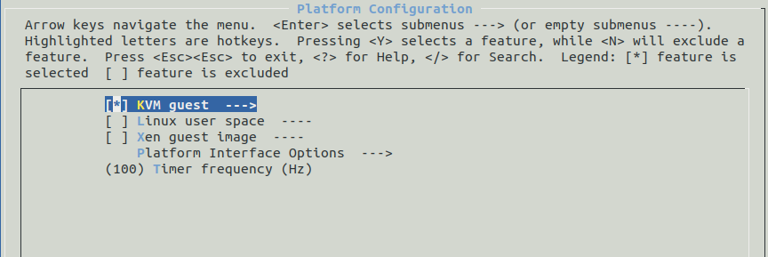
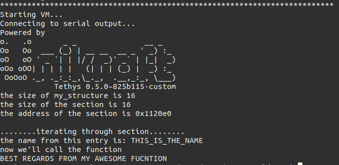
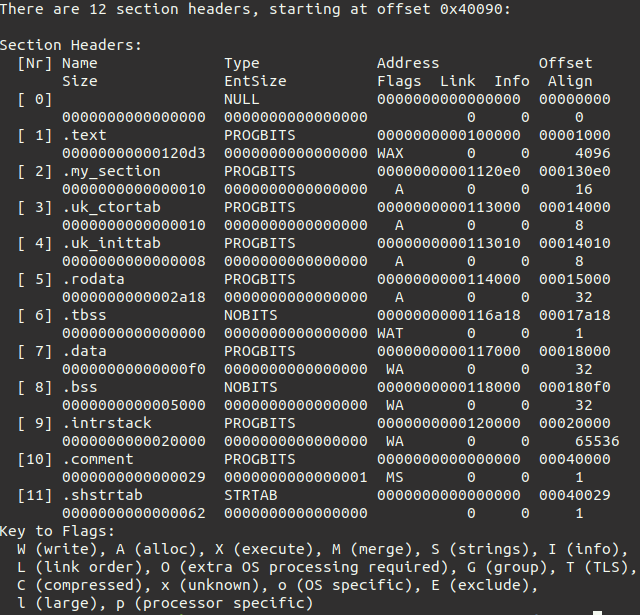
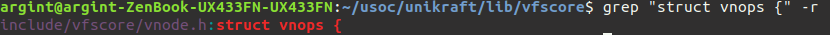

As programs may grow quite complicated, porting them requires a thorough grasp of Unikraft core components, and in certain cases, the addition of new ones. In this session, we'll take a closer look at Unikraft's core libraries and APIs.

## Reminders
TODO: add reminders from previous sessions

## Adding New Sections to the ELF
There are situations in which we want to add new sections in the executable for our application or library.
The reason these sections are useful is that the library (or application) becomes much easier to configure, thus serving more purposes.
For example, the Unikraft virtual filesystem (i.e. the `vfscore` library) uses such a section in which it registers the used filesystem (`ramfs`, `9pfs`), and we are going to discuss this in the following sections.
Another component that makes use of additional sections is the scheduler.
The scheduler interface allows us to register a set of functions at build time that will be called when a thread is created or at the end of its execution.

The way we can add such a section in our application/library is the following:
1. Create a file with the `.ld` extension (e.g. extra.ld) with the following content:
```
SECTIONS
{
	.my_section : {
    	PROVIDE(my_section_start = .);
     	KEEP (*(.my_section_entry))
     	PROVIDE(my_section_end = .);
	}
}
INSERT AFTER .text;
```
2. Add the following line to `Makefile.uk`:
```
LIBYOURAPPNAME_SRCS-$(CONFIG_LIBYOURAPPNAME) += $(LIBYOURAPPNAME_BASE)/extra.ld
```
This will add the `.my_section` section after the `.text` section in the ELF file.
The `.my_section_entry` field will be used to register an entry in this section, and access to it is generally gained via traversing the section's endpoints (i.e. from `my_section_start` to `my_section_end`).

But enough with the chit-chat, let's get our hands dirty.
In the `/demo/01-extrald-app` directory there is an application that defines a new section in the ELF.
Copy this directory to your app's directory.
Your working directory should look like this:
```
workdir
|_______apps
|       |_______01-extrald-app
|_______libs
|_______unikraft
```

Before running the program let's analyze the source code.
Look in the `main.c` file.
We want to register the `my-structure` structure in the newly added section.
In Unikraft core libraries this is usually done using macros.
So we will do the same.

```
#define MY_REGISTER(s, f) static const struct my_structure      \
        __section(".my_section_entry")                          \
        __my_section_var __used =                               \
                {.name = (s),                                   \
                .func = (f)};
```
This macro receives the fields of the structure and defines a variable called `__my_section_var` in the newly added section.
This is done via `__section()`.
We also use the `__used` attribute to tell the compiler not to optimize out the variable.
Note that this macro uses different compiler attributes.
Most of these are in `uk/essentials.h`, so please make sure you include it when working with macros.

Next, let's analyze the method by which we can go through this section to find the entries.
We must first import the endpoints of the section.
It can be done as follows:

```
extern const struct my_structure my_section_start;
extern const struct my_structure my_section_end;
```
Using the endpoints we can write the macro for iterating through the section:

```
#define for_each_entry(iter)                                    \
        for (iter = &my_section_start;                          \
                iter < &my_section_end;                         \
                iter++)

```
{}
If you're not familiar with macros, you may check what they expand to with the GCC's preprocessor.
Remove all the included headers and run `gcc -E main.c`.
{}

Let's configure the program.
Use the `make menuconfig` command to set the KVM platform as in the following image.



Save the configuration, exit the menuconfig tab and run `make`.
Now, let's run it.
You can use the following command:
```
qemu-guest -k build/01-extrald-app_kvm-x86_64
```

The program's output should be the following:



To see that the information about the section size and its start address is correct we will examine the binary using the readelf utility.
The readelf utility is used to display information about ELF files, like sections or segments.
More about it [here](https://man7.org/linux/man-pages/man1/readelf.1.html)
Use the following command to display information about the ELF sections:
```
readelf -S build/01-extrald-app_kvm-x86_64
```

The output should look like this:



We can see that `my_section` is indeed among the sections of the ELF.
Looking at its size we see that it is 0x10 bytes (the equivalent of 16 in decimal).
We also notice that the start address of the section is 0x1120f0, the same as the one we got from running the program.

## Unikraft APIs

One important thing to point out regarding Unikraft internal libraries is that for each “category” of library (e.g., memory allocators, schedulers, filesystems, network drivers, etc.)
Unikraft defines (or will define) an API that each library under that category must comply with.
This is so that it’s possible to easily plug and play different libraries of a certain type (e.g., using a co-operative scheduler or a pre-emptive one).

## VFScore
Take for example the virtual filesystem (i.e. `vfscore`).
This library provides the implementation of system calls related to filesystem management.
We saw in previous sessions that there are two types of filesystems available in Unikraft `ramfs` and` 9pfs`.
Obviously, these two have different implementations of generic file operations, such as reading, writing, etc.
The natural question is: how can we have the same API for system calls (e.g. `read`,` write`) but with configurable functionalities?
The answer is by mapping system calls to different implementations.
This is done by using function pointers that redirect the program's flow to the functions we have defined.

In this regard, the `vfscore` library provides 2 structures to define operations on the filesystem:
```
struct vfsops {
        int (*vfs_mount)        (struct mount *, const char *, int, const void *);
        ...
        struct vnops    *vfs_vnops;
};
```
```
struct vnops {
        vnop_open_t             vop_open;
        vnop_close_t            vop_close;
        vnop_read_t             vop_read;
        vnop_write_t            vop_write;
        vnop_seek_t             vop_seek;
        vnop_ioctl_t            vop_ioctl;
        ...
};
```
The first structure mainly defines the operation of mounting the filesystem, while the second defines the operations that can be executed on files (regular files, directories, etc).
The `vnops` structure can be seen as the `file_operation` structure in the Linux Kernel (more as an idea).
More about this structure [here](https://tldp.org/LDP/lkmpg/2.4/html/c577.htm).

The filesystem library will define two such structures through which it will provide the specified operations.
To understand how these operations end up being used let's examine the open system call:
```
int
sys_open(char *path, int flags, mode_t mode, struct vfscore_file **fpp)
{
        struct vfscore_file *fp;
        struct vnode *vp;
        ...
        error = VOP_OPEN(vp, fp);
}
```
`VOP_OPEN()` is a macro that is defined as follows:
```
#define VOP_OPEN(VP, FP)           ((VP)->v_op->vop_open)(FP)
```
So the system call will eventually call the registered operation.

**NOTE**: In order to find the source that contains the definition of a structure, function or other component in the `unikraft` directory you can use the following command:
```
grep -r <what_you_want_to_search_for>
```
For example:



## RAMFS
TODO

## Scheduler's API
TODO

## WORK
TODO